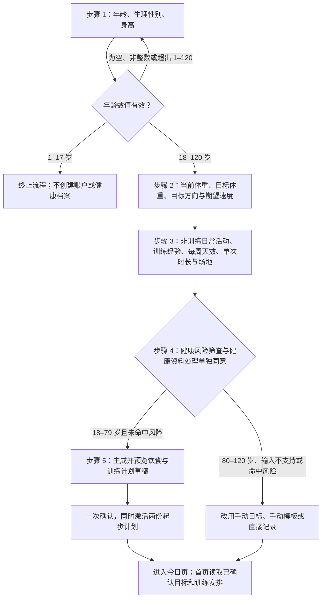
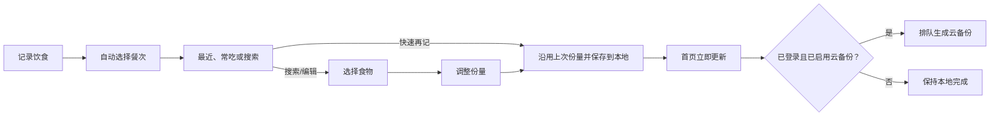
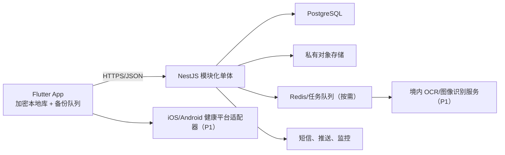

# 食练格：饮食与训练记录 App PRD

> 产品名：食练格  
> 产品口号：一餐一练，轻松记  
> 版本：v1.0（编码前评审稿）  
> 日期：2026-08-09  
> 首发市场：中国大陆  
> 首发人群：18 岁以上、以一般健康管理为目的的用户  
> 文档状态：待名称法律清查、营养数据授权和原型测试通过后冻结

---

## 0. 一页结论

### 0.1 已定名称

产品名称确定为 **“食练格”**。

- “食”明确饮食记录是产品主线。
- “练”对应训练计划和训练日志。
- “格”可以理解为记录格、计划格和有条理的生活节奏，适合后续形成网格化品牌视觉。
- 推荐商店展示名：`食练格 - 饮食与训练记录`。
- 推荐口号：`一餐一练，轻松记`。

“食”“练”都带有业务描述性，正式检索不能只查完整三字，还要重点检查“食练”及同音、近形组合；“格”是否足以避免近似冲突应由商标专业人员判断。

截至 2026-08-09 的初步公开检索结果：

| 检索面 | 初筛结果 | 结论边界 |
|---|---|---|
| 中国区 Apple App Store 搜索 API | “食练格”精确同名结果为 0 | 只能证明该次公开查询未返回精确同名，不能覆盖全部历史或未上架应用 |
| Bing 精确词公开网页检索 | 未发现与健身、饮食软件相关的“食练格”精确结果 | 搜索引擎并非商标数据库，且不能覆盖未公开使用 |
| `shiliange.com` Verisign RDAP | 查询返回 404，未发现 `.com` 注册记录 | 域名状态会实时变化，仍须在购买时复核 |
| 国家知识产权局商标系统 | 本次未完成权利人、近似字形/读音和分类交叉检索 | **上线和对外宣传前必须完成** |

因此，“食练格”当前可视为 **公开市场初筛未发现直接同名冲突的已定产品名**，但不能据此承诺“市场上绝对无人使用”或“绝对不会侵权”。任何个人或工具都无法仅靠普通网页搜索作出这种法律保证。大规模对外宣传前应委托商标代理人或知识产权律师，在第 9、41、42、44 类，以及计划做电商时的第 35 类中检索相同和近似商标，并出具书面清查意见。

### 0.2 产品判断

这个产品不应复制参考图的“健康功能大全”。真正的产品机会是：

1. 用 **10 秒内完成一次常见饮食记录** 建立核心价值。
2. 把饮食和训练放在同一天的闭环中，但让饮食始终保持一级优先级。
3. 用安静、无广告、无商城干扰的界面，服务不喜欢大型健身平台复杂度的人。
4. 首版依靠搜索、最近记录、复制和模板提升效率；AI 只做候选推荐，不承诺从单张照片“精准算热量”。
5. 采用本地优先架构，断网也能完整记录；P0 的可选登录只用于单设备云备份和换机恢复，并发多端同步放到 P1。

### 0.3 最大难点

按影响排序，难点不是页面编码，而是：

1. **食物营养数据的合法来源、质量和中文搜索体验。**
2. **足够快的记录流程。** 如果记录麻烦，再准的算法也不会形成习惯。
3. **照片中的份量估算。** 识别菜名较容易，估出克重、油和酱汁很难。
4. **离线、备份恢复及历史口径。** 重试不能重复记账，食物库更新不能改写历史；并发多端同步属于 P1 的独立难点。
5. **健康数据隐私与中国大陆发布合规。** 体重、饮食、训练和设备数据需要更严格处理。
6. **范围控制。** 社区、商城、断食、睡眠、血糖等都会迅速破坏轻量定位。

### 0.4 推荐首版

首版只保留两个底部主页面：**今日**、**我的**。记录、搜索、编辑、计划等采用二级页面或底部面板。

- 今日：能量/营养摘要、唯一主视觉按钮“记录饮食”、四餐记录、今日训练、体重快捷入口。
- 我的：目标与计划、个人资料、数据趋势、我的食物、训练模板、数据导出、隐私与账户。
- 首次建档：在用户选择自动规划时，根据身体目标、活动水平和训练条件生成可审阅的饮食与训练计划草稿；只有用户确认后才激活。
- 不做：商城、社区、广告、咨询、皮肤、睡眠、排便、血糖、复杂断食工具。

团队版 P0 预计 14–18 周；单人全栈、设计和上架并行时，较现实的是 5–8 个月。

---

## 1. 背景与产品定位

### 1.1 用户问题

现有健康 App 常见两种割裂：饮食工具能算热量，但训练记录较弱；训练工具能排课程，但饮食只是附属功能。综合型平台虽然功能丰富，却常把会员、商城、社区、活动、设备和大量健康卡片放在核心记录之前。

目标用户真正需要的是：

- 吃完后能快速找到食物、选择份量并保存。
- 立刻知道今天还剩多少预算，以及蛋白质等关键营养是否接近目标。
- 到训练时间能打开当天计划，快速记组数、次数、重量或时长。
- 数据属于自己，可离线使用、导出和删除。

### 1.2 产品愿景

让普通人用最少操作，把每天的饮食和训练变成清楚、可回顾、可调整的记录。

### 1.3 产品定位

**面向中国一般健康用户的轻量饮食优先记录工具，并提供足够完整的个人训练计划与记录。**

它不是：

- 医疗诊断或疾病营养处方工具。
- 课程内容平台或健身社区。
- 健身电商或营养品商城。
- 以连续打卡、羞辱或焦虑推动使用的减重产品。

### 1.4 设计原则

1. **记录优先**：首屏先完成当天任务，再展示趋势和内容。
2. **饮食优先**：训练重要，但不与饮食争夺首页主操作。
3. **一处主入口**：首页只有一个一级 CTA“记录饮食”。
4. **重复动作更快**：最近、常吃、复制昨日、复制整餐优先于 AI。
5. **数据诚实**：估算值必须标记为估算；未知值不显示为 0。
6. **用户确认**：AI 结果、目标调整和计划覆盖均需用户确认。
7. **本地可用**：无网时仍可查看和编辑核心记录。
8. **克制运营**：P0 不放广告、商城和弹窗式会员促销。
9. **中性反馈**：不使用“破戒、失败、赎罪”等文案。

---

## 2. 参考页面评估

用户提供的两张页面可作为功能需求参考，但不应作为视觉稿直接复刻。

### 2.1 首页参考图的问题

- 体重方案、周报、饮食、运动、断食、饮水、睡眠、排便和血糖同时出现，核心任务被稀释。
- 页面需要长距离滚动，卡片层级接近，用户难以快速判断“现在该做什么”。
- 多个“+”与相机入口含义不一致。
- 周报和运营内容排在高频记录之前。
- 浅色文字和手写字体降低小字号信息的可读性。
- “AI 拍照算热量”没有展示候选、置信度、份量确认和纠错步骤。
- 运动消耗与“还可吃”之间的计算关系不透明。

### 2.2 个人中心参考图的问题

- 会员、商城、优惠券和活动入口占据首屏，不符合轻量工具定位。
- 个人信息、健康档案、体重方案、饮食计划和全部工具存在边界重叠。
- 皮肤、家庭健康、企业、咨询等功能扩大了隐私和医疗合规范围。
- 数据导出、权限管理、删除数据和注销账户不够突出。

### 2.3 改造结论

- 首页只回答三个问题：**今天吃了什么、还差多少、今天练什么**。
- 个人中心只承载低频管理：**目标、计划、资料、数据、设置、隐私**。
- 首页首屏必须看到剩余热量、记录饮食入口和当天餐次。
- 不照搬参考图中的字体、图标、插画、卡片比例、运营文案、色彩组合或特有布局。功能思想可以借鉴，具体视觉与素材必须原创或取得许可。

---

## 3. 市场与竞品调研

### 3.1 调研方法与边界

本次调研以 2026-08-09 可访问的官方产品页、中国区 App Store 商品页和产品公开说明为主。App 名称、评分、版本和商店可用性会变化；本 PRD 不采用无法核验来源的市场规模预测。

### 3.2 市场结构

当前产品大致分为五类：

| 类型 | 代表产品 | 用户购买的核心价值 | 常见代价 |
|---|---|---|---|
| 本土饮食/体重管理 | 薄荷健康、食卡卡、体重小本 | 中文食物、热量、食谱、减重计划 | 功能、运营入口和付费模块较多 |
| 综合运动平台 | Keep | 训练内容、课程、社区、设备生态 | 体量大，饮食记录不是唯一核心 |
| 力量训练日志 | 训记 | 动作库、计划、组数和重量记录 | 饮食闭环不足 |
| 国际热量工具 | YAZIO、MyFitnessPal、FatSecret | 成熟的热量与宏量营养追踪 | 中国菜、份量、中文别名与大陆可用性存在差异 |
| AI 图片识别工具 | Foodvisor 等 | 降低搜索成本和新鲜感 | 菜名可识别不等于份量、油盐和热量准确 |

### 3.3 2025–2026 市场信号

1. **“饮食 + 健身”已经是融合方向，不再构成独立差异。** 薄荷健康从饮食/体重向运动扩展，Keep 从训练内容向拍照热量和吃练睡洞察扩展，训记也已触及饮食数据。产品必须靠记录效率、数据质量和克制体验区分。
2. **AI 已接近营销标配，不是护城河。** 当前薄荷健康、Keep、YAZIO 和 MyFitnessPal 的官方商品页均突出 AI 能力。真正难以复制的是中文餐食/外卖数据、低成本纠错、透明置信度、个人历史排序与隐私信任。
3. **专业训练记录正在下沉。** Keep 与训记均强调动作、组、重量、次数或训练容量；“运动记录”不能只填时长和估算消耗。食练格应做够用的组级日志，但不建设课程内容平台。
4. **健康平台连接成为成熟产品的基础能力，但中国 Android 生态碎片化。** 数据模型在 P0 预留来源字段，真实接入放 P1，并逐个平台验证权限、去重与商店可用性。
5. **免费核心 + 分层订阅是主流路径。** AI、高级计划和长期分析可以成为未来付费层；手动记录、隐私控制和基础导出不应被锁定。
6. **政策鼓励数字化体重管理，同时抬高健康安全要求。** 国家卫生健康委等部门的[“体重管理年”活动实施方案](https://www.gov.cn/zhengce/zhengceku/202406/content_6959543.htm)提出开发居民体重管理工具，并提及互联网、物联网、大数据、穿戴设备和人工智能的应用。产品仍须严格限制医疗化承诺和特殊人群自动方案。

Keep 的 [2025 年报](https://manager.wisdomir.com/files/676/2026/0423/20260423171501_44046414_en.pdf)提供了一个可核验的成熟平台样本：2025 年平均月活跃用户为 2,177.2 万，平均月订阅会员为 274.2 万，会员渗透率为 12.6%，全年收入约 16.373 亿元。该数据说明内容、会员、广告和自有产品可以形成较大商业体量，但并不证明新产品应复制这条重运营路线；对食练格更重要的是先验证记录留存和高价值用户，而不是追求功能数量。

### 3.4 竞品对比

| 产品 | 核心优势 | 公开功能观察 | 对“食练格”的启示 |
|---|---|---|---|
| 薄荷健康 | 本土食物与体重管理认知强 | 饮食、体重、轻断食、AI、会员及多类健康/运营入口 | 学习本土食物表达，不复制复杂首页和商业入口 |
| Keep | 训练内容与大众品牌强 | 课程、跑步、组级记录、社区、设备、饮食拍照和 AI 教练 | 不与其竞争内容规模，专注私人记录效率 |
| 食卡卡 | 饮食热量与 AI 减重定位直接 | 热量记录、食谱、轻断食和 AI 相关能力 | 饮食赛道已经拥挤，必须以速度、安静界面和训练闭环区分 |
| 训记 | 力量训练记录较深 | 训练计划、动作和训练日志 | P0 的训练日志要“够专业”，但不抢占饮食主线 |
| YAZIO | 追踪流程成熟、视觉统一 | 热量、宏量营养、断食、条码和订阅 | 借鉴流程清晰度，强化中国食物、份量和合规落地 |
| MyFitnessPal | 国际数据库和连接生态成熟 | 热量、宏量营养、条码、设备连接和订阅 | 作为海外能力标杆；本次中国区公开 lookup 返回 0，分发、本地化和合规不能照搬 |
| Foodvisor | 图像辅助记录清晰 | 拍照识别、营养追踪 | 把照片定位为搜索加速器，而不是“精准测量器” |

### 3.5 市场机会

建议占据以下组合位置：

> **中国食物本地化 × 饮食记录优先 × 可用的力量训练日志 × 无运营干扰 × 本地优先与可导出**

这不是单个功能壁垒，而是体验组合壁垒。首版的竞争力来自：

- 常吃食物 2–3 次点击内再次记录。
- 计划与实际同屏，但不把运动热量默认“奖励”为额外饮食额度。
- 食物来源、份量和估算状态透明。
- 无社区、商城和首页广告。
- 游客可用、离线可记、数据可导出。

### 3.6 商业模式建议

P0 免费测试，不在产品价值尚未验证时加入会员墙。

达到留存门槛后，可采用：

- 免费：完整手动记录、基础计划、基础趋势、数据导出。
- 订阅：高级趋势、历史备份版本恢复、更多计划模板、条码/OCR、AI 辅助和高级报表。P0 的手动记录、本地导出及基础换机恢复不进入付费墙。
- 永不付费墙：账户注销、隐私控制、基础数据导出、手动记录。

不建议依赖广告或营养品导购；两者会损害“安静、可信”的定位。

---

## 4. 目标用户与核心任务

### 4.1 目标用户

**A. 饮食管理型上班族**

- 目标：减脂、维持体重或改善蛋白质摄入。
- 痛点：中餐搜索难、称重麻烦、重复输入浪费时间。
- 需要：最近记录、家常份量、复制整餐、快速查看剩余额度。

**B. 有训练习惯的普通健身者**

- 目标：同时管理训练量和饮食。
- 痛点：在饮食 App 与训练 App 之间来回切换。
- 需要：当天训练模板、组次重量记录、历史趋势和蛋白质目标。

**C. 厌倦复杂健康平台的记录者**

- 目标：用一个私人、安静的工具替代备忘录或表格。
- 痛点：广告、社区、弹窗、权限过多，数据难以导出。
- 需要：游客模式、离线记录、可导出、明确权限。

### 4.2 P0 安全边界

- 未成年人。
- 孕期或哺乳期用户。
- 存在进食障碍风险的用户。
- 需要糖尿病、肾病等疾病饮食处方的人群。
- 需要康复、治疗或医疗器械功能的人群。

P0 在首次使用时要求用户输入年龄数值，而不是只勾选“已满 18 岁”。年龄为空、非整数或超出 1–120 时停留在当前步骤并给出字段级错误；1–17 岁时不创建账户或本地健康档案，并终止健康记录流程；18–79 岁可在其他输入有效时使用自动计划；80–120 岁可使用手动记录和手动目标，但 P0 不自动生成饮食或训练计划。年龄门槛在本地临时校验，取得 `health_profile_processing` 单独同意后才写入档案。

孕期/哺乳期、存在进食障碍风险、需要疾病饮食处方、康复治疗或医疗器械功能的成年用户，可以选择纯手动记录，但系统不得为其自动生成减脂、增肌饮食计划或训练计划，并应显示专业咨询提示。存在当前伤病或动作禁忌时，只能使用明确排除相关动作的手动模板；若 P0 无法可靠适配，则降级为自由训练记录。若未来服务未成年人，必须单独设计监护人同意、未成年人模式和更严格的安全规则，不能沿用当前 P0。

### 4.3 Jobs to Be Done

1. 当我吃完一顿饭时，我想快速记下食物和份量，从而知道今天还差多少。
2. 当我经常吃相同食物时，我想一键复用，不想每天重新搜索。
3. 当我准备训练时，我想直接看到今天的动作，并连续记录每一组。
4. 当我调整目标时，我想知道变化从哪一天开始，且历史数据不被改写。
5. 当我不再使用产品时，我想导出并删除所有个人数据。

---

## 5. 产品目标、指标与非目标

### 5.1 P0 产品目标

- 用户首次会话即使跳过自动计划也能完成第一条饮食记录；选择计划引导的用户可在五步内完成建档，预览并确认饮食与训练计划草稿。
- 高频食物再次记录的中位耗时不超过 10 秒。
- 用户一眼分清目标、已摄入和剩余；运动数据与饮食预算分开。
- 用户能自动生成或手动建立每周训练计划，并明确知道计划何时生效。
- 断网、弱网和重复提交不会丢失或重复记录。

### 5.2 北极星指标

**每周有效饮食记录天数（Weekly Valid Food-log Days）**。

“有效记录日”定义为：当天至少两个不同餐次各有一条未删除的饮食记录。不设置最低热量阈值，确保口径可由日志客观复现。

### 5.3 Beta 规划目标

以下是内部验证门槛，不是市场承诺：

| 指标 | 目标 |
|---|---:|
| 首次会话完成第一条饮食记录 | >= 65% |
| 进入目标引导后完成目标设置 | >= 70% |
| 常吃食物再次记录中位耗时 | <= 10 秒 |
| 饮食记录开始到保存完成率 | >= 90% |
| 食物搜索无可用结果率 | <= 8% |
| D7 留存 | >= 25% |
| D30 留存 | >= 12% |
| P0 Crash-free sessions | >= 99.5% |
| Beta 核心 API 月可用性目标 | >= 99.5% |

### 5.4 非目标

- 不用体重下降量作为唯一成功指标。
- 不追求首页停留时长；完成记录后快速离开是成功体验。
- 不在 P0 建设内容社区、短视频、直播或商城。
- 不用 AI 替代用户确认、注册营养师审核或医疗判断。

---

## 6. 功能范围与优先级

### 6.1 P0：首发必须有

| 模块 | 范围 |
|---|---|
| 账户 | 默认游客/本地资料；可选手机号账户用于单设备云备份和换机恢复；游客升级时合并本地数据 |
| 基础资料 | 年龄、生理性别、身高、当前体重、目标体重、活动水平、目标；训练经验、每周可训练天数、单次时长、器械/场地和受限部位；生成建议所需字段解释用途后填写，用户可跳过自动计划 |
| 饮食目标 | 自动或手动设置每日能量和蛋白质/碳水/脂肪目标、早餐/午餐/晚餐/加餐预算与预计周期；规则版本化 |
| 饮食记录 | 早餐/午餐/晚餐/加餐；搜索、最近、快速再记、收藏、自定义食物、编辑、删除、复制上一餐/昨日 |
| 饮食汇总 | 当日能量和三大营养素；日/周趋势 |
| 饮食计划 | 自动生成可编辑草稿，范围为每日营养目标、四餐预算和预计周期；用户确认后激活，不预排具体菜品 |
| 训练记录 | 动作库；力量训练组数/次数/重量；有氧时长/距离；RPE 可选 |
| 训练计划 | 按目标、活动水平和训练条件自动生成周频率、模板与单次时长草稿，或由用户手动创建；确认后最多一个周计划生效，每个星期几关联零或一个训练模板，计划和实际记录分离 |
| 身体数据 | 体重记录与日/周趋势 |
| 我的 | 资料、目标、计划、我的食物、训练模板、趋势、数据导出、账户、隐私和帮助 |
| 基础能力 | 本地优先、离线编辑；登录用户使用版本化快照做单设备云备份/换机恢复；审计与错误恢复 |

### 6.2 P1：验证留存后

- 条码扫描。
- 包装营养标签 OCR。
- 常用餐/菜谱、周食谱和具体菜品计划。
- 菜品照片识别候选及人工纠错。
- 训练休息计时器、更多模板、月趋势、提醒与周报。
- 饮水快捷记录。
- Apple 登录。
- HealthKit、Health Connect 或华为健康平台的有限字段接入。
- 并发多设备增量同步、单条冲突处理和设备管理。

### 6.3 P2：单独立项

- 多角度/深度辅助的份量估算。
- 教练协作或营养师协作。
- 公开分享食谱和社区。
- 智能硬件深度连接。
- 付费高级分析。

### 6.4 明确不进当前路线图

- 睡眠、排便、皮肤、血糖闭环。
- 减重咨询导流、家庭健康档案、企业服务。
- 商城、优惠券、广告和积分任务。
- 无需用户确认的 AI 健康方案。

---

## 7. 信息架构

```text
今日
├─ 日期切换
├─ 今日营养概览
├─ 记录饮食
│  ├─ 最近 / 常吃
│  ├─ 搜索
│  ├─ 收藏 / 自定义食物
│  ├─ 条码 / 标签 OCR（P1）
│  └─ 拍照识别（P1）
├─ 早餐 / 午餐 / 晚餐 / 加餐
├─ 今日训练
└─ 体重快捷记录

我的
├─ 头像与基础资料
├─ 目标与计划
│  ├─ 饮食目标与餐次预算
│  └─ 每周训练计划
├─ 数据趋势
├─ 我的食物 / 收藏
├─ 训练模板
├─ 提醒与设备同步（P1，上线后显示）
├─ 单位与显示
├─ 数据导出 / 云备份状态
├─ 隐私授权 / 安全 / 注销
└─ 帮助与反馈
```

底部只保留两个主导航：`今日`、`我的`。记录器、日历、详情和编辑器不是新的底部 Tab。

---

## 8. 首页 PRD

### 8.1 页面目标

用户打开 App 后，在首屏看到营养摘要、主记录按钮和四个折叠餐次，并快速完成一次饮食记录。训练摘要位于餐次之后，可以出现在首屏下沿或第二屏；不要求在大字体模式下把全部内容强塞进一屏。

以 390×844 pt、系统默认字号验收时，首屏必须完整显示营养摘要、主记录按钮和四个折叠餐次行；系统大字体模式允许纵向滚动，不得截断文字或缩小点击区域。

### 8.2 建议线框

```text
┌─────────────────────────┐
│  <   8月9日 周日   日历   │
│                         │
│  剩余 1,260 kcal         │
│  已摄入 540 / 目标 1,800  │
│  蛋白 42/120  碳水 60/210 │
│  脂肪 18/60               │
│                         │
│  [ + 记录饮食 ]           │
│                         │
│  早餐  2项 · 320 kcal  +   │
│  午餐  0项 · 尚未记录  +   │
│  晚餐  0项 · 尚未记录  +   │
│  加餐  1项 · 220 kcal  +   │
│                         │
│  今日训练                 │
│  上肢 A · 预计 45 分钟     │
│  [开始训练]               │
│                         │
│  体重 72.4kg               │
├─────────────────────────┤
│       今日        我的     │
└─────────────────────────┘
```

### 8.3 功能要求

| ID | 要求 | 优先级 |
|---|---|---|
| H-01 | 顶部默认显示本地时区的当天日期，可左右滑动或打开日历切换 | P0 |
| H-02 | 未来日期只显示计划，不得误记为已完成记录 | P0 |
| H-03 | 主数字显示剩余能量，旁边明确显示已摄入/目标 | P0 |
| H-04 | 蛋白质、碳水、脂肪使用紧凑进度条，不只依赖颜色表达状态 | P0 |
| H-05 | P0 不计算或显示运动 kcal，也不提供热量回补；训练只显示时长、组数或训练量 | P0 |
| H-06 | 全页唯一主视觉按钮为“记录饮食”；餐次“+”和“开始训练”是次级按钮 | P0 |
| H-07 | 点击主按钮后自动选择当前时间对应餐次，并同时展示最近食物与搜索框；点击某餐次“+”则固定该餐次 | P0 |
| H-08 | 四餐折叠态固定单行显示餐次、条目数、能量和“+”；展开后才显示条目与份量，并支持编辑、复制、删除及撤销 | P0 |
| H-09 | 今日训练位于饮食之后；有计划时显示名称、时长和“开始训练” | P0 |
| H-10 | 体重为折叠式次级快捷入口，不能高于饮食和训练模块 | P0 |
| H-11 | 本地已有数据时，即使无网也能正常打开、记录和汇总 | P0 |
| H-12 | 登录用户可看到上次云备份时间、备份中和备份失败状态；失败不阻断本地记录 | P0 |

### 8.4 饮食记录面板

默认结构：

1. 餐次选择，默认根据时间推断，用户可改。
2. 搜索框自动聚焦。
3. 最近记录和常吃列表优先展示；每项提供“按上次份量快速再记”。
4. 搜索结果显示名称、品牌/来源、标准份量和每份能量。
5. 选择后进入份量确认；克、毫升、份、碗、个等单位必须有明确换算来源。
6. 保存后首页立即本地更新，并提供至少 5 秒撤销。

关键规则：

- 快速再记沿用该食物上次确认的份量，保存到自动推断或用户固定的餐次，保存后可撤销。
- 从首页触发 `food_record_cta_tapped` 到 `meal_entry_saved` 计时，包含面板打开耗时；“最近食物 + 沿用上次份量 + 自动餐次”的基准任务最多 3 次点击且中位耗时不超过 10 秒，首页主按钮计为第 1 次点击。
- 连续点击保存、弱网重试或 App 恢复不能生成重复记录。
- 无结果时可直接创建私人自定义食物。
- 修改份量时，能量和营养素实时重算。
- 自定义食物默认仅本人可见，不能未经审核进入公共库。
- P0 删除先在本地软删除，并进入下一份云备份快照；P1 多设备同步上线后使用 tombstone 防止旧设备复活记录。

### 8.5 页面状态

- 未设置目标：显示简短引导和“设置目标”，仍允许先记录。
- 目标已设置、无记录：展示空餐次和最近食物入口。
- 部分餐次已记录：实时更新摘要。
- 超过目标：显示“已超过 180 kcal”等中性事实，不使用失败文案。
- 今日有训练/无训练/已完成训练。
- 离线、未备份、备份中、备份失败。
- 食物数据不完整：未知营养素显示 `--`，不能显示 0。

---

## 9. 个人中心 PRD

### 9.1 页面目标

集中管理低频资料、目标、计划、数据和隐私，不承载商城和运营内容。

### 9.2 建议线框

```text
┌─────────────────────────┐
│  头像  用户名              │
│  减脂 · 当前 72.4kg        │
│                         │
│  目标与计划                │
│  饮食目标与餐次预算      >  │
│  每周训练计划            >  │
│                         │
│  数据与内容                │
│  数据趋势                >  │
│  我的食物与收藏          >  │
│  训练模板                >  │
│                         │
│  设置                      │
│  提醒与设备同步（P1）    >  │
│  单位与显示              >  │
│  数据导出 / 云备份状态   >  │
│  隐私与账户              >  │
│  帮助与反馈              >  │
├─────────────────────────┤
│       今日        我的     │
└─────────────────────────┘
```

### 9.3 功能要求

| ID | 要求 | 优先级 |
|---|---|---|
| M-01 | 首屏显示当前目标和关键身体数据，不显示营销横幅 | P0 |
| M-02 | 基础资料逐项说明年龄、生理性别、身高、当前/目标体重、活动水平及训练条件的用途，并允许用户放弃自动计划、改用手动目标和手动训练模板 | P0 |
| M-03 | 资料、目标或训练条件变更只生成新的计划草稿；先预览影响并确认生效日期，才激活新版本 | P0 |
| M-04 | 饮食计划与训练计划从“我的”编辑，首页只呈现当天执行内容 | P0 |
| M-05 | 数据趋势 P0 支持日、周视图；月视图为 P1；缺失数据不插值伪造 | P0/P1 |
| M-06 | 用户可管理自定义食物、收藏和训练模板 | P0 |
| M-07 | 提醒按用餐/训练分别控制；通知权限在首次启用提醒时申请 | P1 |
| M-08 | 用户可导出饮食、训练、体重和计划数据 | P0 |
| M-09 | 登录用户的退出、删除云端备份和注销账户是三个明确动作；游客另有“清除本机数据” | P0 |
| M-10 | 权限页仅动态展示已上线能力；App 可停止自身处理并引导用户前往系统设置，不能宣称能直接撤销系统权限 | P1 |

### 9.4 数据导出

P0 至少支持 ZIP 包，包含：

- `meals.csv`
- `foods_custom.csv`
- `workouts.csv`
- `workout_sets.csv`
- `body_metrics.csv`
- `goal_suggestions.json`
- `nutrition_plans.json`
- `favorites.json`
- `workout_templates.json`
- `training_plans.json`
- `settings.json`
- `consents.json`
- `profile.json`
- `README.txt`，说明时区、单位、字段和导出时间

游客在设备内生成 ZIP，并通过系统分享面板导出，不依赖云端身份。登录用户发起云端导出时需要二次验证；签名下载链接有效期不超过 15 分钟，导出对象在 24 小时内删除。P1 上线的新个人数据类型必须同步加入导出清单和字段说明，避免“可导出全部数据”的承诺与文件内容不一致。

---

## 10. 核心用户流程

### 10.1 首次使用



要求：

- 五步表示五个连续决策页面，不等同于五次点击。第 1 步的年龄门槛不可跳过；其他资料只在用户选择自动计划时必填。
- 第 1–3 步资料仅保存在当前页面的临时内存中；第 4 步取得 `health_profile_processing` 单独同意后才允许写入本地档案或发送生成请求。拒绝时可浏览公开食物和动作数据，但不能保存个人健康记录。
- 自动计划最低输入为年龄、生理性别、身高、当前体重、目标体重、目标档位和活动水平；训练草稿还需要训练经验、每周可训练天数、单次时长、器械/场地及受限部位。
- 成年用户可以跳过自动计划，直接使用手动饮食目标、手动训练模板或先记录；拒绝非必要资料不得影响已取得核心健康处理同意后的手动记录能力。
- 生成结果必须先保存为 `draft`。首次建档的预览页同时标明估算依据、每日能量、三大营养素、四餐预算、预计周期、周训练模板和单次时长；用户点击“确认并启用计划”后，饮食与训练起步计划才一起激活。退出或返回修改时，草稿不得进入首页或改变现有计划。
- 游客/登录选择不占用核心建档步骤。P0 默认在本地使用；手机号登录和云备份在个人中心按需开启，并继续使用各自独立的同意与授权流程。

### 10.2 快速记录饮食



### 10.3 拍照识别（P1）


未经用户确认的结果只能是草稿。低置信度直接转到搜索，不能静默记录。

### 10.4 执行训练


### 10.5 修改目标或计划


重新计算只产生建议和草稿，不得覆盖当前计划。首次建档用一次明确确认同时启用饮食与训练起步计划；后续修改时可分别确认、分别激活。目标与计划生效日期只允许今天或未来，历史目标、历史计划和已完成记录永不被静默改写。

### 10.6 P0 计划模型

**饮食计划**

- P0 自动饮食计划只包含每日能量/三大营养素目标、早餐/午餐/晚餐/加餐预算与预计周期；不生成具体菜品。
- 计划状态为 `draft`、`active`、`archived`；同一用户同一天只能命中一个 `active` 版本。
- 餐次能量预算启用时总和必须等于每日目标；调整尾差落到用户指定餐次，不能静默丢失。
- 激活新版本时设置 `effective_from_local_date`，旧版本从该日期起结束，但仍供历史日报引用。
- `goal_version` 保存输入、算法建议和预计周期；系统据此创建 `nutrition_plan_version` 草稿，并通过可空的 `source_goal_version_id` 引用建议。用户确认后草稿才转为 `active`；手动目标的该引用为空。
- 首页和历史日报只读取当天命中的 `nutrition_plan_version`，不能直接读取算法建议，避免出现两套目标真相源。
- 具体菜品、周食谱和购物清单属于 P1，不与 P0 目标编辑器混在一起。

**训练计划**

- P0 自动训练计划根据目标档位、活动水平、训练经验、每周可训练天数、单次时长、器械/场地和受限部位，生成周训练频率、训练模板与单次预计时长；不生成康复处方或绝对起始重量。
- P0 允许一个生效中的周计划，每个星期几关联零或一个训练模板。
- 自动结果先创建为 `draft`，用户可以调整训练日和模板；明确确认后才转为 `active`，版本从今天或未来某日生效。生成器或模板策略不可用时，降级为手动模板，不得静默激活通用计划。
- 激活新周计划时，旧 active 版本在新版本生效日前一天截止；预览页列出旧计划未来覆盖项，确认后删除生效日及之后尚未执行的旧覆盖项。
- 某一天可创建 `skip`、`move` 或 `replace_template` 覆盖；覆盖只影响指定日期，不改写循环周计划。
- `move` 仅允许源训练尚未开始，且目标日期没有计划训练或已开始/完成的训练；否则拒绝并要求用户另选日期。移动记录同时保存源日期和目标日期，在源日抑制计划、在目标日注入同一模板。
- 同一日期最多生成一个“今日计划训练”；用户仍可额外创建自由训练记录。
- 开始计划后创建独立 `workout_session`；完成、跳过或改期不会直接修改模板。

---

## 11. 业务规则与计算口径

### 11.1 每日能量

基础建议使用 Mifflin–St Jeor 公式估算 BMR，再乘活动系数得到 TDEE。该值必须标注为估算，并允许用户手动覆盖。以下是工程规则合同；临床配置的具体上下限、目标速度、预计周期和宏量参数必须由注册营养师签字确认，配置缺失时自动建议功能不得上线。

```text
男性参考：BMR = 10W + 6.25H - 5A + 5
女性参考：BMR = 10W + 6.25H - 5A - 161

W = 体重 kg
H = 身高 cm
A = 年龄
```

生成建议所需的生理性别字段只在用户选择自动估算时请求，并明确用途；选择“不提供”时可直接设置手动目标。系统不得从头像、姓名或其他字段推断生理性别。

**输入与活动系数**

| 字段/选项 | v1 工程规则 |
|---|---|
| 年龄 | 必填整数 1–120；空值、非整数或超范围拒绝提交；1–17 岁终止建档，18–79 岁可自动规划，80–120 岁只允许手动目标与手动记录 |
| 生理性别 | 只为用户主动选择的自动能量估算提供公式参数；不提供时转手动目标 |
| 身高 | 120–230 cm；范围外只允许手动目标 |
| 当前体重 | 30–250 kg；范围外只允许手动目标 |
| 目标体重 | 30–250 kg；范围外只允许手动目标；与维持/温和减脂/温和增肌方向不一致时要求用户修正目标或档位 |
| 久坐 | TDEE = BMR × 1.20 |
| 轻度活动 | TDEE = BMR × 1.375 |
| 中度活动 | TDEE = BMR × 1.55 |
| 高度活动 | TDEE = BMR × 1.725 |
| 训练条件 | 经验为新手/规律训练/进阶；每周可训练 1–7 天、单次 15–180 分钟，至少选择徒手或一种可用器械/场地；格式超范围时不生成训练草稿 |
| 孕期/哺乳期、疾病处方、进食障碍风险、康复治疗 | 不自动生成饮食或训练计划，转手动记录并显示专业咨询提示 |

活动水平表示不含计划训练的日常活动。`clinical_policy` 只在生成计划时将日常活动与计划训练频率合成为一个有效活动系数，训练不再以单次运动消耗二次叠加到 TDEE，也不在首页提供运动热量回补；日常活动或训练频率发生实质变化时，由用户主动更新条件并生成新草稿。

**目标调整与宏量营养**

```text
raw_target_kcal = TDEE × (1 + goal_adjustment_pct)
target_kcal = clinical_policy.clamp(raw_target_kcal)
protein_g = weight_kg × clinical_policy.protein_g_per_kg
fat_g = target_kcal × clinical_policy.fat_energy_pct / 9
carb_g = (target_kcal - protein_g × 4 - fat_g × 9) / 4
```

- `goal_adjustment_pct`、蛋白质系数、脂肪占比、能量上下限均来自版本化 `clinical_policy`，不能散落硬编码在客户端。
- 工程可预置的目标档位为维持、温和减脂、温和增肌；营养师签字前相应策略状态为 `unapproved`，客户端不得返回自动建议。
- 预计周期由当前体重、目标体重和 `clinical_policy` 批准的目标速度计算，展示为估算范围并说明会受实际体重变化影响；维持目标显示版本化策略规定的复评周期，不承诺完成日期。
- 能量展示取整到最接近的 10 kcal，宏量营养取整到 1g；数据库保留未舍入值。
- 碳水计算为负数、输入缺失、配置过期或命中安全限制时，停止自动计算并转到手动目标/专业咨询提示。
- `goal_versions` 保存输入快照、公式版本、临床策略版本和建议输出，保证结果可追溯；它不直接驱动首页。用户确认后的最终执行值写入 `nutrition_plan_versions`，并可引用 `source_goal_version_id`。

**自动训练计划**

- 自动训练规则使用版本化 `training_policy` 和经审核的训练模板；规则至少定义经验等级、目标到模板的映射、每周频率、连续训练日限制、单次时长范围、器械要求和受限部位排除。
- 生成频率不得超过用户每周可训练天数，单次预计时长不得超过用户可用时长，模板不得引用用户未选择的器械；无法同时满足时不生成草稿，并说明需要修改哪个条件或改用手动模板。
- 当前伤病、动作禁忌或康复需求超出已审核模板覆盖范围时，不自动替换为未经审核的动作，直接降级为手动记录或专业咨询提示。
- `training_policy` 缺失、过期或未审核时，客户端不得返回自动训练计划。相同输入、策略和模板版本必须生成相同草稿；草稿保存输入、策略和模板版本，用户确认前不影响首页。

### 11.2 剩余能量

P0 固定使用：

```text
剩余能量 = 当日目标 - 已摄入
```

P0 不计算运动 kcal，也不提供运动回补开关，避免 TDEE 活动系数与训练消耗重复计算。P1 若加入设备或 MET 估算，必须另行冻结基线、来源优先级、公式、计入比例/上限和算法版本；在这些规则完成前，运动数据只显示时长、距离和训练量。

### 11.3 能量与营养单位

- 数据源的 kJ 原值应保留，展示换算使用 `1 kcal = 4.184 kJ`。
- 公共食物以每 100g/100ml 为标准基准，同时存储常用份量。
- 包装标签的能量与宏量营养素可能因舍入存在差异，不自动用宏量营养素反推并覆盖标签值。
- 未知营养素使用 `NULL`，不能在 SQL 聚合中被当作 0。
- 每种营养素汇总同时返回 `known_sum`、`unknown_item_count` 和 `total_item_count`。
- 只要存在未知值，界面显示“至少 42g · 1 条缺数据”等不完整口径；能量存在未知值时，“剩余能量”显示为不可完整计算，而不是给出精确数字。
- 当天完全没有条目时，摄入量 0 是已知的空集合结果，与“已有条目但营养值未知”区分。

### 11.4 历史快照

每条饮食记录保存当时的：

- 食物名称与品牌。
- 份量、单位与克/毫升换算。
- 能量与营养素。
- 数据来源、版本和质量等级。

公共食物库之后修改，不得自动改写用户历史记录。

训练历史采用同样原则：`workout_session` 和 `workout_set` 保存执行时的动作名称、单位、目标组次、实际组次和模板版本快照；之后编辑模板或动作库不能改变历史训练。

### 11.5 日期与时区

- 记录保存 `occurred_at_utc`、IANA `time_zone_id`、当时的 `utc_offset_minutes` 和业务 `local_date`。
- “一天”按用户选定的本地时区计算。
- 跨时区旅行时不自动搬移已经完成的历史餐次；用户可手动调整日期。
- 未来计划与提醒按 IANA 时区计算，以正确处理夏令时变化。
- 目标与计划只允许今天或未来生效；P0 禁止回填过去生效日，避免与“不改写历史”冲突。

---

## 12. 技术实现方案

### 12.1 推荐架构

**客户端**

- Flutter：一套代码覆盖 iOS/Android。
- Riverpod 或 Bloc：状态管理，按团队现有经验二选一。
- Drift + SQLCipher（或等效字段加密）：本地记录、搜索缓存、备份队列和离线汇总。
- Keychain/Keystore：保存访问令牌和本地数据库密钥；敏感数据库和图片缓存排除系统未受控云备份。
- 相机、HealthKit、Health Connect/厂商健康平台通过插件或原生桥接。

**服务端**

- NestJS 模块化单体。
- PostgreSQL 作为主数据库。
- 按账户、食物、计划、备份、饮食记录、训练、同步（P1）和媒体（P1）拆领域模块。
- Redis 只在验证码限流、热点缓存或任务队列确有需要时加入。
- 私有对象存储保存临时图片，使用短时签名 URL。

**部署**

- 中国大陆云区域，生产与预发布隔离。
- HTTPS、托管 PostgreSQL、自动备份、日志、指标和告警。
- 密钥进入 KMS/密钥管理服务。
- 不建议直接以海外 BaaS 作为大陆生产主后端。



### 12.2 为什么不先做微服务

P0 的主要不确定性是产品留存和数据质量，不是吞吐量。模块化单体可以保留清晰边界，同时减少部署、调用链、分布式事务和监控成本。搜索或图像识别达到独立扩容需求后再拆服务。

### 12.3 核心数据实体

| 实体 | 用途 | 关键设计 |
|---|---|---|
| `accounts` | 账户与状态 | 不与个人健康资料混表 |
| `profiles` | 基础资料和单位 | 年龄、生理性别、身高、活动水平、训练经验/时间/器械与限制；敏感字段最小化，自动计划可跳过；当前体重写入 `body_metrics`，目标体重写入 `goal_versions`，避免重复真相源 |
| `consents` | 同意记录 | 保存范围、文案/处理者版本、授予/撤回时间、证据摘要和单调递增的 `consent_epoch` |
| `goal_versions` | 算法建议 | 当前/目标体重等输入、每日目标、预计周期、算法/临床策略版本快照；不直接驱动首页 |
| `nutrition_plan_versions` | 用户执行目标 | 每日目标、四餐预算和预计周期草稿；可引用 `source_goal_version_id`；确认后才从 `draft` 转为 `active` |
| `foods` | 公共或私人食物 | 来源、版本、质量等级、可见范围 |
| `food_aliases` | 中文别名/拼音/地区称呼 | 支持规范化搜索 |
| `food_portions` | 克/毫升与常用份量 | 换算必须有来源 |
| `recipes` / `recipe_items`（P1） | 自定义菜谱和组合餐 | 保存组成与产出份量 |
| `meal_entries` | 单条饮食记录 | 营养快照、客户端 UUID、IANA 时区与本地日期 |
| `exercise_catalog` | 动作库 | 动作类型、目标肌群、单位 |
| `workout_templates` | 训练模板 | 与实际 session 分离并版本化 |
| `training_plan_versions` / `training_plan_days` | 周训练计划 | 建档输入、训练策略/模板版本、周频率、单次预计时长；每星期零或一个模板；确认后才从 `draft` 转为 `active` |
| `training_plan_overrides` | 指定日期覆盖 | `skip/move/replace_template`；移动保存源/目标日期 |
| `workout_sessions` / `workout_sets` | 训练历史 | 中途恢复、软删除、动作/单位/目标组次/模板版本快照 |
| `body_metrics` | 体重等身体记录 | 单位换算和来源 |
| `devices` | 登录设备 | P0 一个 active writer；换机时显式迁移 |
| `backup_snapshots` | P0 云备份 | 版本、哈希、设备、epoch、创建状态和保留期 |
| `sync_changes`（P1） | 增量同步 | 单调序列、epoch、服务端版本和 tombstone |

所有用户记录使用客户端生成 UUID。本地保存 `client_modified_at`；进入 P1 同步后，服务端维护 `server_version`、服务端 `updated_at` 和 `deleted_at`，并对 `(account_id, client_uuid)` 建唯一约束。用户操作通过有明确作用域和保留期的幂等键提交。

### 12.4 API 边界示例

```text
POST   /v1/auth/guest/upgrade
GET    /v1/foods/search?q=&cursor=
POST   /v1/devices/activate
POST   /v1/backup-snapshots
GET    /v1/backup-snapshots/latest
POST   /v1/sync/push                 # P1
GET    /v1/sync/pull?cursor=&epoch=  # P1
POST   /v1/exports                    # 登录用户；游客在本地导出
DELETE /v1/account
```

客户端首页汇总应从本地数据库即时计算，P0 以本地结果为交互权威；云备份生成和完整性校验均不得阻塞首页。P1 服务端可异步复核，但每次打开首页仍不依赖网络聚合。

### 12.5 P0 本地优先与单设备云备份

1. 用户操作先写入加密本地数据库事务，UI 立即成功，所有核心功能不依赖网络。
2. P0 上传的是与物理 SQLCipher 文件分离的**逻辑快照**，不是数据库文件。Manifest 至少包含 `schema_version`、`app_version`、`backup_epoch`、`local_generation`、各实体 `record_counts`、创建时间和 `content_sha256`；Payload 只含用户资料、同意记录、自定义食物、饮食/训练/体重记录、目标、计划、模板、收藏和设置，不含公共食物库、缓存、令牌、本地密钥、分析事件或临时图片。
3. P0 采用服务端可解密、KMS 信封加密的恢复模型：TLS 传输，快照对象使用每账户数据密钥加密，数据密钥再由 KMS 主密钥保护。该方案不是端到端加密，必须在云备份单独同意中明确。新设备通过认证下载逻辑快照，校验 schema、记录数和哈希后，用新设备生成的新 SQLCipher 密钥重建本地库。
4. active device 的本地数据库是 P0 用户记录的业务真相源；服务端不再把同一批 `meal_entries`、`workout_sessions` 等写入另一套关系表。云端只保存已完成提交的恢复快照，避免双重真相源。
5. 本地事务递增 `local_generation`；登录用户在前台联网时于变更后 30 秒空闲、App 进入后台前和手动点击“立即备份”时尝试备份。前台网络可用时，变更到成功备份的 P95 目标为 5 分钟。
6. 备份分为 initiate、对象上传和 finalize。每个异步任务携带创建时的 `cloud_backup consent_epoch`；Finalize 在单个服务端事务中校验 `active_device_id + backup_epoch + consent_epoch + base_backup_version + content_sha256`。只有同意仍有效且 CAS 成功，才递增 `backup_version` 并把对象标记为 authoritative；旧同意 epoch、校验失败或乱序快照必须拒绝，不能覆盖较新版本。
7. P0 每个账户只允许一个 active writer。换机使用两阶段流程：prepare activation -> 下载并在临时库校验/恢复 -> 用户确认 -> commit activation。Commit 再次 CAS 校验预期备份版本，随后原子递增 `backup_epoch`、切换 active device，并撤销旧设备 refresh token 和写权限；短期 access token 使用短 TTL 尽快失效。
8. 被撤销旧设备进入“仅本机，云备份已停用”状态，可继续本地导出，但任何旧 epoch 上传都被拒绝。迁移页展示最后成功备份时间；旧设备可用时先提示立即备份，旧设备丢失时只能恢复最后成功版本。
9. 免费用户可恢复最新成功快照。服务端额外保留上一份快照 7 天仅用于故障恢复；最新快照损坏、schema 不兼容或哈希不匹配时，必须自动回退并提示恢复上一份，不在界面承诺任意历史版本。
10. 游客升级账户时使用一次性 `import_id` 幂等导入；失败可重试，不得复制记录。

“删除云端备份”同时删除所有用户快照并关闭自动备份；队列立即停止，在线快照在 15 个日历日内删除，灾备副本按 90 天上限轮换。用户之后必须重新开启并重新同意，系统才可上传新快照。

这个范围没有并发编辑，因此 P0 不展示“冲突解决”界面。它用明确的单设备约束换取更小、更可验证的首版。

### 12.6 P1 并发多设备同步协议

P1 再引入记录级 Outbox 和增量同步：

- `(account_id, client_uuid)` 唯一；新增记录天然合并。
- 服务端为每个账户生成单调 `change_sequence`，客户端游标不依赖设备时间。
- 每次 push 带 `sync_epoch` 和基准 `server_version`；旧 epoch 上传直接拒绝，要求先 rebase。
- 游标过期返回明确错误，客户端下载全量快照、建立新 epoch 后才能继续上传。
- 同一条记录并发修改时返回双方内容，由用户逐条选择，不能静默 last-write-wins。
- 删除生成 tombstone，在线保留 180 天；离线超过该窗口的设备必须全量 rebase，因此不能重新创建已删记录。
- 幂等键作用域为 `(account_id, device_id, operation)`，服务端至少保留 30 天；即使幂等记录过期，客户端 UUID 唯一约束仍防止重复新增。
- 账户注销不是普通软删除：立即撤销令牌和所有 epoch，并按注销 SLA 清除业务数据、对象和备份。
- 不使用 `client_modified_at` 判断最终版本；它只用于展示和诊断，权威顺序来自服务端版本。

### 12.7 本地数据保护

- 游客库与每个账户库物理隔离；敏感本地库使用 SQLCipher 或经安全评审的等效加密。
- iOS 密钥使用 Keychain `ThisDeviceOnly` 类属性，Android 使用硬件支持且不可导出的 Keystore 密钥，均不得同步到系统云钥匙串或普通设备备份。
- 原始照片和导出临时文件不进入普通缓存；使用受保护目录，并按 TTL 删除。
- 退出或切换账户前先提示最后备份时间和未备份数据；用户确认后立即锁定并清除该账户本地库、令牌和密钥，下一位设备使用者不能查看。独立游客库不因账户退出而删除。
- 注销成功后删除本地数据库、缓存、令牌和密钥；若存在未备份数据，确认页必须明确列出影响。
- 崩溃日志和分析事件不得包含食物备注、身体数据、图片路径、手机号或令牌。

---

## 13. 食物数据与搜索

### 13.1 数据策略

不能抓取竞品食物库，也不能默认《中国食物成分表》可自由商用或再分发。开发完整产品前必须取得数据所有方书面授权或确认许可条款。

建议三层数据：

1. 经授权的中国基础食物成分数据，覆盖常见原料和家常菜。
2. 来源明确的品牌/包装食品数据；条码只是标识，不等于营养数据。
3. 用户自定义食物默认私有，审核后才可进入公共库；P1 的菜谱沿用同一可见性规则。

### 13.2 搜索能力

必须支持：

- 简体中文名称。
- 品牌和商品名。
- 地区叫法和别名。
- 拼音全拼与首字母。
- 生/熟状态。
- 常用份量。
- 最近、频次和个性化排序。

P0 可在客户端内置数千个高频条目并缓存最近/常用。服务端先用 PostgreSQL 的规范化名称、别名和拼音字段；公共库达到十万级、召回和排序无法满足指标后再引入专用搜索引擎。

### 13.3 数据治理后台

即使用户端只有两个主页面，运营端仍需要最小数据后台：

- 新增、编辑、下架和回滚食物。
- 合并重复条目。
- 查看数据来源和授权范围。
- 标记异常值和质量等级。
- 审核用户纠错与公共条目申请。
- 追踪某版本影响了哪些新记录，不改写历史快照。

**编码门槛：第 2 周前未确认可商用数据源和再分发权，就不进入完整食物库开发。**

---

## 14. AI、条码与健康平台

### 14.1 AI 拍照识别

核心事实：从一张照片识别“可能是什么菜”相对可行；判断“吃了多少克”、用了多少油和酱汁误差很大。同名菜的烹饪差异也会显著影响能量。

因此按以下顺序迭代：

1. P0：搜索、最近、收藏、快速再记和复制上一餐。
2. P1：条码和包装营养标签 OCR。
3. P1：菜品照片返回 Top 3 菜名候选，不自动估克重。
4. P2：有参照物、多角度或深度信息时再评估份量估算。

照片流程要求：

- 客户端压缩并移除 EXIF。
- 使用私有 Bucket 和短时签名 URL。
- 第三方模型返回标签/检测框；后端通过规范名、别名和审核映射层生成内部 `food_id` 候选、置信度和可解释提示。
- 用户必须确认菜名和份量。
- 原图无论成功、失败或任务超时，都必须在上传后 24 小时内删除。
- 不默认把用户照片用于训练；复用需单独、可撤回的明示同意。
- 供应商合同必须约定境内处理、不得留存、不得用于训练、删除证明、分包商范围和安全事件通知。

P1 开发前冻结至少 1,000 张、覆盖家常菜/外卖/混合菜/遮挡/不同光线的独立测试集。Beta 发布门槛建议为：Top-3 菜名命中率 >= 85%，无需改菜的确认率 >= 70%，从上传到候选返回 P95 <= 6 秒，识别流程完成率 >= 80%。门槛需按菜品大类分层查看，不能只看总体平均；未达到时不发布主入口。

### 14.2 条码与标签 OCR

- 条码命中后仍展示品牌、规格、数据来源和最后校验时间。
- 未命中允许扫描营养标签并人工确认字段。
- OCR 保存的是确认后的结构化数据，不直接把识别文本作为正式营养值。
- 公开共享前需要审核，防止恶意或错误数据污染公共库。

### 14.3 健康平台

- iOS：HealthKit 按体重、步数、训练等类型逐项申请，P1 先只读。
- Android：Health Connect 不能作为中国大陆所有设备的唯一方案；华为等厂商接口需分别评估资质、审核与可用性。
- 每条外部记录保存 `source_platform + external_id + start/end + type`。
- 先用 `source_platform + external_id` 做精确幂等。跨来源且时间重叠的记录只能标记为“疑似重复”，结合类型、重叠率、时长和距离让用户确认；不得只按时间段和来源优先级自动删除。
- 步数等聚合数据优先使用平台官方聚合接口，不能把手机和手表原始样本直接相加。
- 权限拒绝、部分授权和撤回应当是正常状态，不影响手工记录。
- 权限页展示“是否已请求”和产品侧处理开关，并可跳转系统设置。App 不能承诺直接撤销系统权限；HealthKit 也不能可靠向 App 暴露用户是否拒绝了读取权限。

---

## 15. 安全、隐私与合规

工程和产品设计统一把饮食、体重、训练及健康平台数据按敏感个人信息保护。最终法律定性、文案和流程仍需中国律师确认。

### 15.1 最低上线要求

- 建立数据地图：字段、目的、来源、处理者、保存期限、共享方和删除方式。
- 在处理敏感个人信息、向其他个人信息处理者提供数据、自动化决策或个人信息出境等适用场景前完成个人信息保护影响评估并留档。
- 区分委托处理者与独立第三方：委托处理须签订处理协议、限定目的/期限/方式并监督；独立第三方共享按适用要求告知并取得单独同意。
- 相机、相册、通知和健康权限仅在对应 P1 功能上线且用户首次使用时请求；P0 不展示尚未实现的权限项。
- 首次隐私同意前不初始化会采集设备标识的统计、推送、客服等 SDK。
- App 内公开第三方 SDK 清单、用途、数据类型和隐私政策链接。
- 优先境内存储；调用境外模型或 API 前单独评估个人信息出境路径。
- 提供查询、更正、导出、撤回同意、删除和 App 内注销。
- 游客的隐私同意版本和时间先保存在本地，升级账户时随其他资料上传。
- 与照片识别、短信、推送、监控供应商签订数据处理和安全事件条款。
- 建立泄露事件响应流程、内部升级责任人、证据保全和依法通知用户/主管机关的机制。
- 办理域名/网站 ICP 备案及移动互联网 App 备案。
- 按实际系统与业务评估公安联网备案、等保定级和增值电信许可。
- 为国内 Android 商店准备软件著作权、App 备案、隐私政策、权限说明和 SDK 清单。

同意不得与总隐私政策、登录或系统权限捆绑，不得默认勾选，也不得用一次同意覆盖未上线能力。每条记录保存 `scope + policy_version + consent_text_version + processor_list_version + granted_at + withdrawn_at + locale + evidence_hash + consent_epoch`；处理目的、数据范围或接收方发生实质变化时重新取得同意。系统权限与产品侧同意是两套状态，取得其中之一不代表自动取得另一项。

| `consent_scope` | 阶段与请求时机 | 为什么需要 | 拒绝的影响 | 撤回后的处理 |
|---|---|---|---|---|
| `health_profile_processing` | P0；首次保存饮食、训练、体重、身体资料，或生成个性化目标/计划前 | 处理核心记录及其本地汇总；用户主动选择时，年龄、生理性别、身高、当前/目标体重、活动水平和训练条件用于生成饮食与训练计划草稿 | 可浏览公开食物/动作数据和预览产品，但不能保存个人健康记录；拒绝非必要身体字段时仍可在该同意有效的前提下使用手动记录、手动目标和手动训练模板 | 用户确认撤回后立即停止新增、汇总和个性化处理，级联关闭其他三个范围并关闭记录入口；确认页提供先导出，本机健康库随后删除，在线健康数据和快照进入 15 个日历日删除流程，灾备副本按 90 天上限轮换；撤回不影响撤回前处理的合法性 |
| `cloud_backup` | P0 可选；登录后、第一次上传任何逻辑快照前 | 把加密逻辑快照交由服务端处理，用于单设备备份和换机恢复；明确说明服务端可解密且不是端到端加密 | App 保持本地优先，饮食、训练、目标和导出仍可用，但没有云恢复保障 | 立即递增 `consent_epoch`、停止队列并拒绝旧 epoch 的在途 finalize，关闭自动备份；在线快照在 15 个日历日内删除，灾备副本按 90 天上限轮换，本机数据不删除；再次开启必须重新明示同意 |
| `photo_recognition` | P1 可选；第一次上传照片识别前，另行请求相机/相册系统权限 | 将用户主动选择的图片发送给自有后端和披露的识别处理者，以返回候选菜名 | 仅拍照识别不可用，搜索、最近食物和手动记录不受影响 | 立即停止新上传并取消未提交任务；服务端原图和临时结果在上传后 24 小时内删除，已由用户确认写入的结构化饮食记录仍按 `health_profile_processing` 管理 |
| `health_platform_import` | P1 可选；第一次读取前，按平台和数据类型展示范围，并另行请求系统权限 | 从用户选择的健康平台读取体重、步数或训练等指定类型并去重导入 | 仅自动导入不可用，手动记录和导出不受影响 | 立即停止轮询/订阅，撤销产品侧令牌并删除未确认缓存；引导用户到系统设置撤销平台权限；已导入记录由用户选择保留为普通记录或批量删除 |

`health_profile_processing` 是保存个人饮食与训练记录所必需的独立同意，也是其他三个范围的前置条件；其他三个范围彼此独立且均为可选能力。任何可选同意被拒绝或撤回，都不得降低核心手动记录能力，也不得通过反复弹窗强迫授权。异步处理任务必须携带并在写入正式数据前复核相应 `consent_epoch`，不能只在任务创建时检查一次。

初始数据保留 SLA：

| 数据 | P0/P1 保留与删除规则 |
|---|---|
| P1 原始饮食照片 | 上传后最多 24 小时，成功/失败均删除 |
| 导出 ZIP | 游客分享结束后清理本地临时文件；云端对象最多 24 小时 |
| P0 云备份 | 最新成功快照 + 上一份故障恢复快照；上一份最多 7 天 |
| 崩溃诊断日志 | 最多 30 天，禁止业务正文和健康字段 |
| 相关网络日志 | 至少六个自然月；如现行法规或等级保护要求更长则从其规定 |
| 其他安全/审计日志 | 按数据地图确定，初始设为六个自然月；不得记录业务正文和完整健康数据 |
| 注销后的在线业务数据 | 15 个日历日内删除或不可逆匿名化 |
| 灾备副本中的已注销数据 | 最迟 90 天随备份轮换清除，期间隔离且不得恢复到生产使用 |

上述期限是产品 SLA，法律顾问和云服务灾备设计确认后冻结；任何延长都需说明目的并更新隐私政策与数据地图。

### 15.2 工程控制

- TLS 传输；数据库、对象存储和备份加密。
- 手机号等标识字段级保护。
- 管理员最小权限、MFA 和审计日志。
- 短信验证码限流；访问令牌轮换；设备会话可下线。
- 业务日志禁止出现手机号、访问令牌、原始照片 URL 和完整健康数据。
- 隐私删除任务可追踪、可重试、可审计。

### 15.3 健康与医疗边界

- 仅声明“一般健康与生活方式管理参考”。
- 不做诊断、治疗、疾病控制或保证减重的承诺。
- 自动建议必须显示估算、算法版本和调整入口。
- 异常 BMI、过低目标或连续过度训练只做风险提示和专业求助建议。
- 若未来加入疾病饮食、血糖闭环或医疗判断，需重新评估医疗器械和互联网医疗边界。

### 15.4 参考截图的知识产权边界

- 不复制截图中的品牌标识、插画、图标、字体文件和具体文案。
- 不做足以造成来源混淆的高相似页面布局或视觉装潢。
- 仅提炼通用功能需求和交互问题，重新完成信息架构、组件体系和品牌设计。

---

## 16. 非功能需求

| 维度 | P0 目标 |
|---|---|
| 启动 | 代表性中端 Android 设备，本地已有数据时首页可用内容 < 2 秒 |
| 本地写入 | 保存一条记录 P95 < 200ms |
| 搜索 | 常用/本地结果 < 300ms；国内网络 API P95 < 800ms |
| 可靠性 | 本地事务和备份重试 1,000 次不产生重复记录/快照；换机恢复有自动化回归 |
| 稳定性 | Crash-free sessions >= 99.5% |
| 可用性 | Beta 核心 API 月可用性目标 99.5%；正式生产目标 99.9%，服务故障时本地记录仍可用 |
| 灾备 | 对已确认写入云端的数据，MVP 目标 RPO <= 1 小时、RTO <= 4 小时，并实际演练恢复；离线设备尚未上传的数据不计入云端 RPO |
| 无障碍 | iOS 点击区域不小于 44×44 pt，Android 不小于 48×48 dp；字体放大不截断；颜色不是唯一状态表达 |
| 本地安全 | 加密库静态检查通过；密钥不进入日志/普通备份；注销和切号清理有自动化测试 |
| 权限 | P1 不授权相机、通知或健康平台时，核心手动记录仍完整可用 |

---

## 17. 验收标准

### 17.1 饮食记录

- 点击首页主按钮后，一次操作即可看到最近食物和搜索框。
- 基准任务从点击“记录饮食”到 `meal_entry_saved`：最近食物、上次份量、自动餐次，最多 3 次点击且中位耗时不超过 10 秒。
- 份量改变时，能量和营养素实时重算。
- 保存、编辑、复制和删除后，餐次与全天汇总一致。
- 删除后至少提供 5 秒撤销。
- 连续保存或网络重试不生成重复记录。
- 无搜索结果时可直接创建私人自定义食物。
- P1 AI 结果未经确认不得写入正式记录。
- 任一条目存在未知能量时，全天能量显示“至少 X”且剩余能量标记为不可完整计算。

### 17.2 首页

- 首屏出现剩余能量、记录饮食入口和当天餐次。
- 在 390×844 pt、系统默认字号下，首屏完整显示营养摘要、主按钮和四个折叠单行餐次；大字体模式允许滚动但不截断。
- 饮食在页面顺序和视觉权重上高于训练。
- 切换日期后，所有汇总和列表同步切换。
- 超过目标时正确显示数值并使用中性文案。
- 离线时可新增、编辑、删除并看到正确本地汇总。

### 17.3 训练

- 用户在两次点击内开始今日训练或快速记录运动。
- 动作组支持修改、删除、中途退出后恢复。
- 完成训练后，时长和训练数据立即进入当天汇总。
- P0 不出现运动 kcal 或回补开关；训练汇总只使用时长、距离、组数和训练量。

### 17.4 个人中心与隐私

- 年龄输入为空、非整数或超出 1–120 时不能继续；1–17 岁不创建账户或健康档案，18–79 岁可进入自动计划，80–120 岁只进入手动记录和手动目标。
- 在用户同意前，年龄门槛以外的首次建档字段不得写入档案或发送到服务端；拒绝自动计划所需的非必要字段，不影响成年用户后续选择手动记录。
- 修改资料后可重新计算建议，但未经确认不覆盖现有目标。
- 用户可查看、导出和删除自己的饮食、训练和身体数据。
- 退出、删除数据和注销文案不混淆。
- P1 相机、通知和健康权限只在对应功能首次使用时请求；P0 不展示这些尚未上线的权限项。
- 注销完成后，登录凭证失效；在线数据按政策进入可追踪删除流程。
- 四个 `consent_scope` 可独立查看和操作；拒绝或撤回任一可选范围，不影响手动饮食和训练记录。
- 撤回 `health_profile_processing` 后不再接受健康记录写入，用户可先导出再触发本机与在线健康数据删除；再次记录必须重新明示同意。

### 17.5 P0 备份与换机

- 无网新增 100 条记录后恢复网络，生成的最新云备份可在新设备完整恢复。
- 同一 `backup_id` 重复发送不产生第二个逻辑版本。
- 激活新设备后，旧设备写令牌失效，不能覆盖新 epoch 的备份。
- 迁移前存在未备份数据时必须明确提示，且旧设备可导出本地 ZIP。
- 游客升级账号失败可重试，且不会重复导入。
- 最新快照 schema、记录数或哈希校验失败时，不把任何部分写入正式本地库；自动改用上一份可用快照并明确提示恢复版本，若两份都不可用则终止恢复且保留原设备数据。
- 较新版本 finalize 成功后，再到达的旧 `base_backup_version` 或旧 `local_generation` finalize 必须返回 `409 STALE_BACKUP_BASE`；authoritative 版本不变，未引用对象进入清理队列；同一成功 `backup_id` 因响应丢失而重试时返回原版本，不再递增版本号。
- 新设备完成临时库恢复后，若 commit activation 的预期备份版本 CAS 失败，则返回 `409 BACKUP_CHANGED`；新设备不得成为 active writer、旧设备令牌不得撤销，界面要求重新 prepare 并基于最新快照恢复。
- 撤回 `cloud_backup` 后，服务端原子递增 `consent_epoch` 并关闭备份；客户端队列立即停止，旧 epoch 的在途 finalize 返回 `403 CONSENT_WITHDRAWN` 且不得成为 authoritative。本机记录保留，在线快照进入 15 个日历日删除任务，灾备副本在 90 天内轮换清除；重新启用前必须取得新的同意记录。

### 17.6 目标与计划

- 自动饮食计划所需的年龄、生理性别、身高、当前/目标体重、目标档位和活动水平全部有效时才可生成；自动训练计划还要求训练经验、每周可训练天数、单次时长、器械/场地和限制条件有效。
- 临床策略、训练策略或所需模板缺失、过期、未审核，或输入超范围时，不生成相应自动计划并转到手动设置。
- 孕期/哺乳期、进食障碍风险、疾病处方或康复治疗命中安全边界时，不生成自动饮食或训练计划；手动记录入口保持可用并显示专业咨询提示。
- 相同输入、公式版本、临床策略、训练策略和模板版本必须得到相同未舍入结果与相同计划草稿。
- 自动饮食草稿仅包含每日能量、三大营养素、四餐预算和预计周期；自动训练草稿仅包含周频率、训练模板和单次预计时长。P0 不得出现系统生成的具体菜品、周食谱或购物清单。
- 新生成的饮食与训练计划初始状态均为 `draft`；首次建档在同一预览页一次确认两份起步计划，后续修改可分别确认。在相应确认前，不得改变首页目标、今日训练或现有 `active` 版本。
- 目标只允许今天或未来生效；激活新版本不改变历史日报引用。
- 饮食餐次预算启用时总和与每日目标一致。
- 预计周期必须标注为估算；目标体重与目标档位方向冲突时不得生成，要求用户修改其中一项。
- 自动训练频率不得超过用户可训练天数，单次预计时长不得超过可用时长，模板不得使用未选择的器械或被排除的动作。
- 同一日期只命中一个 active 饮食计划和一个计划训练。
- 训练计划的跳过、改期和替换只生成日期覆盖，不改写循环模板。
- 修改训练模板后，已完成 session 的动作、单位和目标组次快照不变。

### 17.7 搜索、单位与导出

- 固定回归集覆盖中文规范名、别名、品牌、拼音全拼、首字母、生/熟和无结果场景。
- 克、毫升和常用份量换算使用同一源数据；往返编辑不产生超过既定舍入误差的漂移。
- 游客可离线生成完整 ZIP 并通过系统分享；登录用户下载链接 15 分钟后失效，云端 ZIP 24 小时内删除。
- 导出文件逐项覆盖 P0 个人数据实体，时间、时区、单位和字段含义与 `README.txt` 一致。

### 17.8 P1 多设备同步门槛

P1 发布前另行通过并发编辑、游标过期、epoch 失效、180 天 tombstone、全量 rebase 和账户注销场景；这些不作为 P0 上线依赖。

---

## 18. 测试与分析

### 18.1 关键事件

```text
onboarding_started
onboarding_age_gate_completed
profile_onboarding_completed
goal_onboarding_started
goal_created
auto_plan_generation_started
auto_plan_generation_completed
auto_plan_generation_failed
plan_draft_viewed
manual_plan_fallback_selected
food_record_cta_tapped
food_record_opened
food_search_submitted
food_search_no_result
food_selected
portion_changed
meal_entry_saved
food_quick_added
meal_entry_undone
meal_entry_copied
nutrition_plan_activated
training_plan_activated
plan_day_overridden
workout_started
workout_completed
backup_completed
backup_failed
export_requested
account_deletion_requested
```

事件不得包含原始食物备注、照片、手机号、年龄、生理性别、身高、当前/目标体重、伤病描述或完整健康数据。`onboarding_age_gate_completed` 仅在合格成年人完成适用的隐私告知与统计处理条件后发送，只记录 `eligible_auto/eligible_manual_only` 枚举；未成年人和无效输入不得持久化或发送该事件，只在本地原型测试中观察。计划生成失败只记录经审核的原因枚举。分析字段应采用最小化、枚举化设计。

### 18.2 可用性测试

在编码前用可点击原型测试至少 8–12 名目标用户，覆盖：

- 在五步内完成首次建档，在同一预览页理解并确认饮食与训练起步计划草稿。
- 输入不支持的年龄或风险条件后，理解为何转入手动记录，且仍能找到手动入口。
- 记录一份常见早餐。
- 再次记录昨天吃过的食物。
- 创建自定义食物。
- 开始并完成一组力量训练。
- 修改目标并确认生效日期。
- 查找数据导出和注销入口。

若高频重复食物无法在 3 次点击或 10 秒内完成，先调整流程，不进入更多首页功能开发。

### 18.3 必测边界

- 年龄为空、小数、文本、0、17、18、79、80 和 121；未成年人流程不得留下账户或健康档案。
- 自动计划输入缺失、目标体重方向冲突、临床/训练策略过期、训练器械或时长无法匹配，以及风险人群降级。
- 首次双计划草稿确认、全部放弃及返回重填；后续饮食或训练草稿单独确认与重新生成。任何未确认草稿均不得覆盖当前计划。
- 弱网、断网、重复请求、App 被系统终止。
- 跨时区、午夜前后、夏令时环境。
- 克/毫升/份的换算与舍入。
- 食物库版本更新和历史快照。
- P0 云备份中断、重复上传、新设备迁移和旧设备令牌失效。
- P1 多设备同条目编辑/删除、游标过期和全量 rebase。
- P1 权限拒绝、撤回和部分授权。
- 注销后重装和游客数据处理。

---

## 19. 里程碑、团队与成本

### 19.1 团队假设

- 1 名 Flutter 工程师。
- 1 名后端工程师。
- 产品、UI/UX、QA 合计 1–2 个全职当量。
- 注册营养师、隐私/知识产权顾问按阶段参与。
- 使用第三方 OCR/视觉服务，不自训大型视觉模型。

### 19.2 建议排期

| 周期 | 交付 |
|---|---|
| 第 1–2 周 | 范围冻结、原创交互原型、名称法律清查、营养数据授权、数据地图、技术骨架 |
| 第 3–6 周 | 游客/账号、资料目标、食物库、搜索/最近/自定义、饮食记录、本地数据库 |
| 第 7–9 周 | 训练记录与模板、体重、首页汇总、个人中心 |
| 第 10–12 周 | 单设备云备份/恢复、导出/注销、隐私、安全、监控、数据治理后台 |
| 第 13–16 周 | 全量测试、性能与安全整改、灰度准备、备案和商店送审 |
| 缓冲至第 18 周 | 修复送审反馈并达到灰度/发布条件 |
| P1 另加 8–12 周 | 多端同步、条码/OCR、照片候选、健康平台、周食谱与高级周报 |

备案、软著、隐私材料和商标工作从第 1 周并行，不应等代码完成后才开始。14–18 周表示团队达到送审/灰度条件；备案和商店审核属于外部流程，完成日期不能由研发排期保证。

### 19.3 粗略成本

- P0：约 45–70 人周。
- 单人从设计到双端上架：约 5–8 个月。
- 约 5,000 MAU、文本记录为主的大陆云：单区 Beta 粗估 1,500–6,000 元/月；满足正式生产 99.9% 目标的双应用实例、托管数据库高可用和 PITR 方案，建议按 4,000–12,000 元/月询价。
- 不包含：人工、营养数据库授权、短信、第三方识别、等保/审计、商店材料和法律服务。

估算假设为峰值 API QPS < 20、PostgreSQL 数据 < 50GB、对象存储 < 100GB、应用/诊断日志约 30GB/月，未含税。正式预算必须逐项列出可用区、数据库规格、出网、备份、至少六个自然月的相关网络日志冷存储、其他审计日志策略、监控和短信；开发者账号、软著/备案材料、安全测试、法律与营养数据授权作为一次性成本单列。

AI 月成本按下式预算：

```text
月识别次数 × 供应商单次报价 + 图片存储与流量
```

例：3,000 DAU、平均 0.5 次/日，即约 45,000 次/月；单次价格每差 0.10 元，月成本相差 4,500 元。

---

## 20. 主要风险与决策门槛

| 风险 | 影响 | 缓解与门槛 |
|---|---|---|
| 营养数据无合法授权 | 产品无法可靠上线 | 第 2 周前拿到书面许可或更换数据方案 |
| 食物搜索命中差 | 直接伤害留存 | 先建设别名、拼音、最近和纠错，不用 AI 掩盖数据问题 |
| 照片份量误差 | 误导用户并损害信任 | 只返回候选；必须确认；不宣传“精准” |
| 记录步骤过多 | 用户停止使用 | 以 3 次点击/10 秒为硬门槛做原型和可用性测试 |
| P0 备份/换机丢失 | 用户误以为旧设备离线数据已上云 | 显示最后成功时间；迁移前警告；旧设备可本地导出；epoch 阻止覆盖 |
| P1 多端重复/覆盖 | 健康记录不可信 | UUID、幂等、版本冲突、tombstone、rebase 和自动化回归 |
| 健康平台数据重复 | 能量和训练统计失真 | 保存来源标识，先只读，建立去重测试集 |
| 自动计划规则未冻结 | 首页目标或训练安排不可编码、不安全 | 营养师签字确认 `clinical_policy`，训练专业人员签字确认 `training_policy`；任一缺配置时禁用对应自动建议 |
| 本地敏感数据泄露 | 共享设备或备份暴露健康记录 | 加密本地库、系统密钥库、缓存 TTL 和切号/注销清理测试 |
| 隐私或商店整改 | 上线延期 | 数据地图、备案、软著和 SDK 清单从第 1 周并行 |
| 范围膨胀 | 轻量定位失效 | 睡眠、血糖、商城、社区必须单独立项 |
| 名称/界面侵权 | 被投诉、下架或改名 | 名称正式清查并申请商标；视觉全部原创 |

---

## 21. 编码前必须完成的决策

### 21.1 已建议默认采用

- 产品名：食练格。
- 首发：中国大陆，18 岁以上一般健康管理。
- 双端方案：Flutter。
- 后端：NestJS 模块化单体 + PostgreSQL。
- 数据策略：P0 本地优先 + 单设备版本化云备份；P1 再做并发多端同步。
- P0：手动快速记录；不做照片自动记账。
- P0 自动计划：饮食只生成每日能量、三大营养素、四餐预算和预计周期；训练只生成周频率、模板和单次时长；结果先为草稿，用户确认后激活，不生成具体菜品或周食谱。
- 导航：今日、我的两个主页面。
- 商业化：Beta 阶段不放广告和会员墙。

### 21.2 开发启动门槛

1. 商标代理完成“食练格”及近似名称检索，确认第 9、41、42、44 类策略。
2. 确认营养数据库来源、商用范围、再分发权和更新机制。
3. 完成五步首次建档、计划草稿确认、首页、记录面板、训练记录和个人中心可点击原型。
4. 用 8–12 名目标用户验证首次计划建档与高频饮食记录耗时。
5. 由营养师冻结 `clinical_policy` 的活动系数、目标调整、预计周期、宏量参数、上下限和版本并签字确认；由合格训练专业人员冻结 `training_policy` 的经验分级、频率、时长、模板映射、器械和动作限制并签字确认。
6. 完成个人信息数据地图、个人信息保护影响评估模板和第三方 SDK/处理者预审。
7. 确定云厂商、短信、推送、对象存储和备份区域。
8. 确定 Android 首发商店清单，倒推软著、备案和审核材料。

---

## 22. 名称正式清查清单

对外发布前，由专业机构完成：

- 国家知识产权局：精确检索“食练格”。
- 近似字形/读音：食练、食炼格、食练阁、食练馆、练食格、SHILIANGE 等。
- 第 9 类：可下载软件、移动应用相关商品。
- 第 42 类：SaaS、软件服务及技术服务。
- 第 41 类：健身训练、课程服务。
- 第 44 类：营养和健康咨询；即使 P0 不做咨询，也应评估未来防御。
- 第 35 类：若未来做商城、广告或商业平台再评估。
- 企业名称、公众号/小程序、主流应用商店、域名和社交媒体账号。
- 图形 Logo 单独做图形近似检索。
- 确认后尽早提交商标申请，再开始大规模公开宣传。

---

## 23. 资料来源

访问日期均为 2026-08-09。

### 名称与品牌初筛

1. [中国区 Apple App Store 搜索 API：“食练格”](https://itunes.apple.com/search?term=%E9%A3%9F%E7%BB%83%E6%A0%BC&country=cn&entity=software&limit=50)
2. [Bing 精确搜索：“食练格”](https://cn.bing.com/search?q=%22%E9%A3%9F%E7%BB%83%E6%A0%BC%22)
3. [Verisign RDAP：SHILIANGE.COM（404 表示查询时未找到）](https://rdap.verisign.com/com/v1/domain/SHILIANGE.COM)
4. [国家知识产权局商标网上查询](https://sbj.cnipa.gov.cn/sbj/sbcx/)

### 竞品官方/商店资料

5. [薄荷健康：中国区 App Store](https://apps.apple.com/cn/app/id457856023)
6. [Keep：中国区 App Store](https://apps.apple.com/cn/app/id952694580)
7. [Keep 官方产品介绍](https://www.calorietech.com/appIntro)
8. [食卡卡：中国区 App Store](https://apps.apple.com/cn/app/id6450910950)
9. [训记：中国区 App Store](https://apps.apple.com/cn/app/id1464915553)
10. [YAZIO：中国区 App Store](https://apps.apple.com/cn/app/id946099227)
11. [MyFitnessPal 官方网站](https://www.myfitnesspal.com/)
12. [Foodvisor：中国区 App Store](https://apps.apple.com/cn/app/id1064020872)
13. [MyFitnessPal：美国区 App Store](https://apps.apple.com/us/app/id341232718)
14. [MyFitnessPal：中国区 Apple lookup](https://itunes.apple.com/lookup?id=341232718&country=cn)
15. [Keep 2025 Annual Report（2026-04-23）](https://manager.wisdomir.com/files/676/2026/0423/20260423171501_44046414_en.pdf)
16. [Keep 投资者关系：财务报告索引](https://ir.keep.com/en/financial_report.php)
17. [“体重管理年”活动实施方案（2024-06-26）](https://www.gov.cn/zhengce/zhengceku/202406/content_6959543.htm)
18. [“体重管理年”活动实施方案解读（2024-06-26）](https://www.gov.cn/zhengce/202406/content_6959545.htm)

### 技术、健康与合规参考

19. [Mifflin–St Jeor 方程原始论文摘要（PubMed）](https://pubmed.ncbi.nlm.nih.gov/2305711/)
20. [Apple HealthKit 文档](https://developer.apple.com/documentation/healthkit)
21. [Apple App Review Guidelines：Health and Health Research](https://developer.apple.com/app-store/review/guidelines/#health-and-health-research)
22. [Android Health Connect 文档](https://developer.android.com/health-and-fitness/health-connect)
23. [《中华人民共和国个人信息保护法》](http://www.npc.gov.cn/npc/c2/c30834/202108/t20210820_313088.html)
24. [《中华人民共和国数据安全法》](http://www.npc.gov.cn/npc/c2/c30834/202106/t20210610_311888.html)
25. [国家法律法规数据库：《中华人民共和国网络安全法》现行文本检索入口](https://flk.npc.gov.cn/)
26. [《网络数据安全管理条例》](https://www.gov.cn/zhengce/content/202409/content_6977766.htm)
27. [工信部《关于开展移动互联网应用程序备案工作的通知》](https://www.miit.gov.cn/zwgk/zcwj/wjfb/tz/art/2023/art_920db564162e4312916a01bed6540ad8.html)

---

## 24. 版本记录

| 版本 | 日期 | 说明 |
|---|---|---|
| v1.0 | 2026-08-09 | 编码前评审稿：名称初筛、市场定位、双页面 PRD、技术方案、合规、验收与路线图 |
